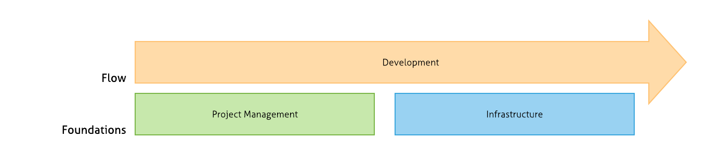
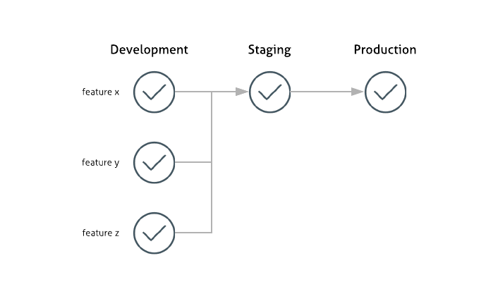
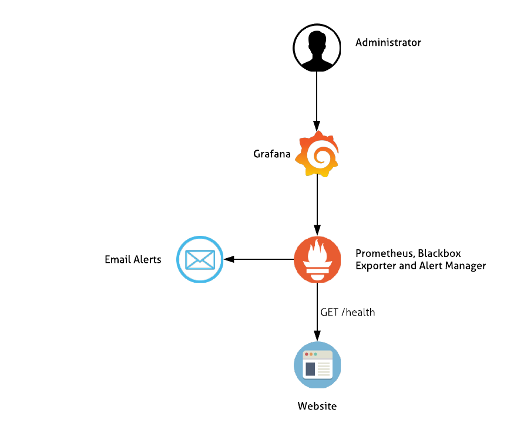
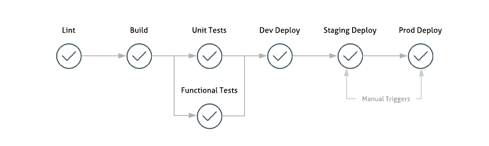

# :runner: Lean Development Flow

Attempt to document the ideal development process - from the organization to the technical layer to achieve the best balance in terms of simplicity, velocity and engineer happiness.

**Note that this is an opinionated guide - right down to the technology used, but it is just that - a guide, so feel free to pick and mix ideas.**

# Table of Contents

   * [Lean Development Flow](#runner-lean-development-flow)
   * [Table of Contents](#table-of-contents)
      * [Purpose](#purpose)
      * [Project Management](#chart_with_downwards_trend-project-management)
         * [Fun](#fun)
         * [WIP Limits](#wip-limits)
         * [Meetings](#meetings)
            * [Replenishment Meetings](#replenishment-meetings)
            * [Standups](#standups)
            * [Retrospectives](#retrospectives)
      * [Infrastructure](#infrastructure)
         * [Environments](#environments)
         * [Configuration as Code](#configuration-as-code)
         * [Kubernetes](#kubernetes)
         * [Monitoring](#monitoring)
         * [Bug Tracking](#bug-tracking)
      * [Development](#development)
         * [Repositories](#repositories)
         * [Branching Strategy](#branching-strategy)
         * [Continuous Integration](#continuous-integration)
            * [Linting](#linting)
            * [Testing](#testing)
            * [Deploying](#deploying)
         * [Versioning](#versioning)
         * [Documentation](#documentation)
         * [Packaging](#packaging)
         * [Feature Flags](#feature-flags)
      * [Continuous Improvement](#continuous-improvement)
      * [Discussion Points](#discussion-points)
         * [Why can't I/My engineers talk about what I did yesterday or what I am doing today during the standup?](#why-cant-imy-engineers-talk-about-what-i-did-yesterday-or-what-i-am-doing-today-during-the-standup)
         * [Optional Meetings?!](#optional-meetings)

## Purpose

In many organizations more and more of an engineers time is being dedicated to organizational tasks rather than on what they were hired for; engineering. Whether it be recording the time worked on a ticket or spending hours in planning meetings. Overall this reduces the velocity of the project and in a time where a startup could launch tomorrow and destroy your USP speed is vital.

We must dilute the purpose of a project, and indeed of many organizations to a simple task:

	To delivery new features into customers hands as fast as possible.

While many teams strive for this they sacrifice the quality of the code, lack of testing or poor design. This document is an attempt to detail the ideal development workflow focusing around two foundations and what it aids: the development process.

## :chart_with_downwards_trend: Project Management

[Kanban](https://www.atlassian.com/agile/kanban) should be used to manage tasks (or 'Stories') related to the project. The columns within the board can be developed as the flow becomes more defined, but to keep it basic stories can have the following state:

* **Backlog** - This is ordered by business priority. Business priority should be the amount of money being lost by this story not being implemented. 
* **Todo**
* **In Progress**
* **Done**

Sprints should not be used as they limit the scope we have to rapidly change direction following customer, business or technical feedback.

### Fun

We want to make people enjoy coming to work, some examples to make things a bit less corporate:

* Use Emoji in Git commit messages like [the Atom project](https://github.com/atom/atom/blob/master/CONTRIBUTING.md#git-commit-messages).
* [Tacos](https://www.heytaco.chat/)

### WIP Limits

The Todo and In Progress columns should be have a WIP (Work in Progress) Limit. This number should be the count of engineers on the project.

### Meetings

Meetings should be kept to a very minimum, in terms of both duration and attendees as well as being optional to everyone - if someone feels like they do not have anything to contribute they should not be expected to be there.

#### Replenishment Meetings

Occur Weekly - 30 minutes.

The following two tasks occur:

* Verify the backlog is prioritized correctly. 
* Identify spare capacity in the 'Todo' column and pull in a story if any. Before the story is pulled in it must first be reviewed by all attending to verify its purpose is clear.

#### Standups

Occur Daily - 10 minutes. 

Going right-to-left on the Kanban board the only question that should be answered for each story is:

`Is there anything blocking the flow of this user story?` 

#### Retrospectives

Occur Monthly - 1 hour. 

Retrospectives are fundamental to continuous improvement, giving team members a chance to speak freely and suggest improvements to the various concerns they have.

There are literally [books](https://www.amazon.co.uk/Agile-Retrospectives-Making-Pragmatic-Programmers/dp/0977616649) written on how Retrospectives should be ran and everyone has there own way of doing it, which shouldn't be resisted. 

Ideally, each team member is giving the opportunity to run a retrospective and to come up with their own preferred way. 

See [Example Retrospective](example_retrospective.md)

## Infrastructure

### Environments

Services should follow a simple 'Route-to-Live' flow going through the following 3 environments:

* `development` - features (branches) are deployed to this environment. Each service should be able to have multiple versions of itself running within the one environment.
* `staging` - identical to the production environment. Used to verify deployment in a live setting as well as enabling the ability to manually test or demo the change.
* `production` - locked down environment. In large financial organisations, this is the only environment which should require change requests be raised for deploying to.

### Configuration as Code

No manual changes should be required to spin up services and infrastructure - with perhaps the exception of account creation perhaps.

* **[Terraform](https://www.terraform.io/)** should be used for managing the infrastructure as code.
* **[Docker](https://www.docker.com/)** should be used to contain the application.

### Kubernetes 

### Monitoring

Every HTTP service should expose `GET /health` endpoint. This endpoint verifies connectivity to dependent services (For example a database or key-value store) before returning HTTP status code of `200`. 

**[Prometheus](https://prometheus.io/)** should be used for monitoring across the platform. Exporters can be used for collecting data across the platform. For example, the blackbox exporter will be used to regularly contact the health-check endpoints for each service to verify its status.

**[Grafana](https://grafana.com/)** can then be used to visualize the data Prometheus collects. 

**[Alert Manager](https://prometheus.io/docs/alerting/alertmanager/)** can be used to configure alerts to various sources when a specific event occurs.

### Bug Tracking

**[Sentry](https://sentry.io/)** will be used to manage and track bugs. It is offered as a free-self-hosted solution but also has a SaaS option. 

The libraries will be installed on all components (API, Web UI) and on an exception being raised will send the alert to Sentry for Developers to manage.

## Development

### Repositories

Git will be used to version control the components. The following is an example of Git Repositories:

* **project-infrastructure** - Terraform Code to deploy the project's infrastructure.
* **project-api** - HTTP API code of the project.
* **project-web** - Web UI for the project.
* **project-docs** - Non-component specific documentation written in Markdown.

### Branching Strategy

Follow the [Github Flow](https://guides.github.com/introduction/flow/) branching strategy.  

The Master Branch must be Production Ready and pull requests must pass all tests/linting/approval count prior to being merged in.

### Continuous Integration

Each Git Repository will have an associated CI Build. The specific steps within this pipeline may be dependent on the type of service, but as an standard layout:

#### Linting 

Linting is a **must**. For example:

* [Rubocop](https://github.com/rubocop-hq/rubocop)
* [Yamllint](https://github.com/adrienverge/yamllint)
* [Markdown Lint](https://github.com/markdownlint/markdownlint)
* [Golint](https://github.com/golang/lint)

#### Testing 

Followed by unit and functional testing.

#### Deploying

If the branch is a feature branch it is automatically deployed to the development environment - the infrastructure will be prefixed with the branch name.

If this is the master branch manual steps to deploy to staging and production environment is giving.

### Versioning

With the exception of libraries (which should use [semantic versioning](https://semver.org/)) components should **not** be versioned unless we require to maintain (through bugfixes) previous versions. 

With the hope of daily or hourly deployment, the need for a version goes out the window. Where required for rollbacks or verification purposes a hash of the commit will suffice.

### Documentation

Documentation should be treated just like any other source code. Ideally, it should be located in a `/docs` directory within the components repository.

In the event where the documentations subject isn't component specific, for example, documentation on practices or how-to-guides, a dedicated repository will be used with `-docs` appended in the name.

The documentation repository should follow all other conventions: using GitHub flow and CI (Markdown Lint).

Using tools such as [Gitbook](https://github.com/GitbookIO/gitbook-cli) or [jekyll](https://jekyllrb.com/) the markdown can be published into HTML or PDF formats for user-friendly reading and distribution. Github Pages has support for Jekyll.

### Packaging

Where possible Docker should be used to package components to allow platform agnostic deployments, wither it runs on the developer's laptop, AWS or Google Cloud.

### Feature Flags

One of the main challenges that may be faced when doing Continuous Deployments of components is where the new feature that is being introduced relies on changes to multiple dependent components. For example, the web interface may require a new API endpoint. 

While in the development environment where we would have branches running off the same feature branch name to allow connectivity, the staging and production environments will run off the master branch, and if only our web interface change has been merged in the functionality of the service will be broken.

To combat this we will use [Feature Flags](https://martinfowler.com/articles/feature-toggles.html), this allows us to conditionally enable specific features, for example, we can enable the new web UI changes only when the API has been updated to support it. 

## Continuous Improvement

	The most dangerous phrase in the language is, "We've always done it this way." - **Grace Hopper**
	
The ways of working should constantly evolve as pain points are identified and aired through retrospectives. What is important is everyone has the ability to voice their ideas and shape ways of working. That being said this should only sacrifice speed at the last resort. 

## Discussion Points

### Why can't I/My engineers talk about what I did yesterday or what I am doing today during the standup?

While the idea of a Scrum standup is ideal on paper (To keep everyone up-to-date on what others are doing) in reality they are long-winded and attention span on unrelated subjects are next to a minimum.

These days it seems like stand-ups are turning into a management progress update; it can be the only interface for managers to know on progress and blockers, and even to keep an eye on the performance of staff. These people should be directed to the Kanban board for live status check, rather than once a day. 

### Optional Meetings?!

We must resist the urge to associate not attending meetings to no progress or interest. Managers must trust engineers to make their best judgment, that's why we hired them after all. 
