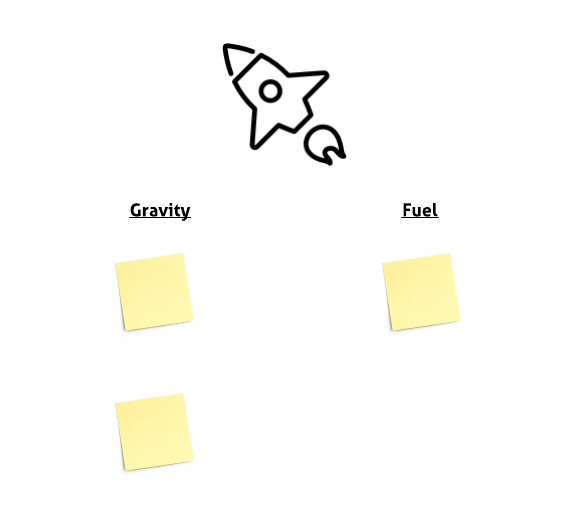

# Example Retrospective

**Draw Method of Propulsion**

5 minutes before the start I will /attempt/ to draw a method of propulsion on a whiteboard. For example an Aeroplane, Rocket or Bike.

It will then have a section for the 'Pros' and 'Cons' - for example a rocket will have 'Fuel' and 'Gravity'. 

**Review Actions from Last Retrospective**

Once everyone is in the room we will go over the actions that came out of the last retrospective and any progress that has been made.

**Populate Board**

Each engineer will be giving a pack of sticky-notes which they can write the Pros and Cons of the last month and place on the board.

**Summary of Items**

Once the wall has been populated we will go through each of they sticky notes and the 'owner' of it will give a small summary of it. Discussion at this point must be kept to a minimum as to not waste time.

**Vote**

Each engineer will have 3 votes for what to action next. The top 3 stories will then be chosen.

**Discuss and Action**

Have an open discussion around the 3 stories and if possible come up with an action for the owner of it to work on.

**Follow Up**

After the Retrospective I always send out an email detailing all the tasks that where listed on the board, the ones that where most popular and the actions we chosen to take on.

